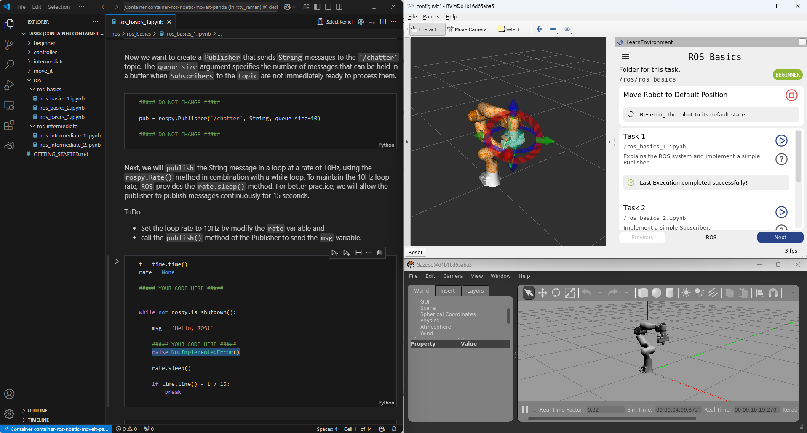

# Learn Environment for Franka Panda Robot - RViz Plugin

The Learn Environment for the Franka Panda Robot is a tutorial on how to program the robot via its Python API. There are predefined tasks that the user has to complete. These tasks are provided as Jupyter Notebooks with code cells that the user needs to fill in. The plugin can start the tasks and automatically evaluate if they are solved correctly.

### Install the Plugin:
If you only want to use the plugin, the **easiest option** is to use a **devcontainer** or **Docker setup** from [this](TODO:ADD_LINK) repository.

Alternatively without Docker, you can implement this repository as a submodule in your catkin workspace or copy the entire plugin into your catkin workspace.

### Start the Tutorial:
Instructions on how to start the tutorial can be found here: [GETTING_STARTED.md](./tasks/GETTING_STARTED.md).

### Contribute:
Instructions and guidelines on how to contribute to this plugin (creating new tasks & extending the plugin) can be found here: [CONTRIBUTE.md](./developer_docs/CONTRIBUTE.md).