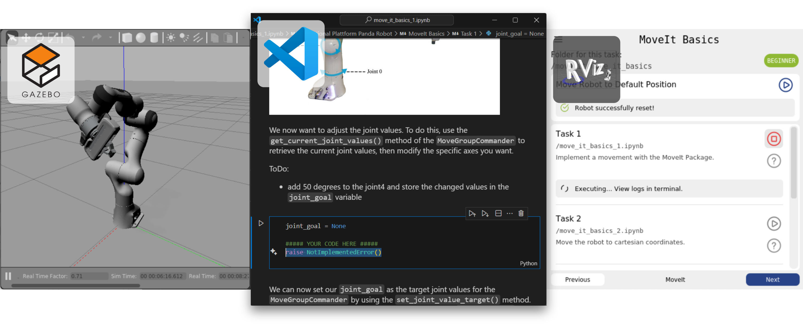

# Learn Environment for Franka Panda Robot - RViz Plugin

    

The Learn Environment for the Franka Panda Robot is an interactive tutorial platform for programming the robot via its Python API. Users complete predefined tasks provided as Jupyter Notebooks, and this custom RViz plugin automatically manages execution, connects to the simulation/hardware, and evaluates the solutions in real-time.

<b>🎥 Click to watch the Demo Video</b>

 
<video src="https://github.com/user-attachments/assets/901cc920-3bfe-4793-afcb-ffeb993343a3
" controls="controls" width="100%">
  Your browser does not support the video tag.
</video>

---

### System Architecture Whitepaper
For a high-level overview of the platform's pedagogical design and how the components (ROS, Gazebo, VS Code, and this RViz plugin) integrate, please read the project whitepaper:
**[📥 Download the System Overview Whitepaper (PDF)](https://raw.githubusercontent.com/MalteMatthey/Learn-Environment-Franka-Emika-Panda/main/developer_docs/system_overview_whitepaper.pdf)**

### Install the Plugin:
If you only want to use the plugin, the **easiest option** is to use a **devcontainer** or **Docker setup** from [this](https://github.com/MalteMatthey/Containerized-Setup-for-Learn-Environment-Franka-Emika-Panda) repository. There you can find a detailed setup instruction.

Alternatively without Docker, you can implement this repository as a submodule in your catkin workspace or copy the entire plugin into your catkin workspace.

### Start the Tutorial:
Instructions on how to start the tutorial can be found here: [GETTING_STARTED.md](./tasks/GETTING_STARTED.md).

### Contribute:
Instructions and guidelines on how to contribute to this plugin (creating new tasks & extending the plugin) can be found here: [CONTRIBUTE.md](./developer_docs/CONTRIBUTE.md).