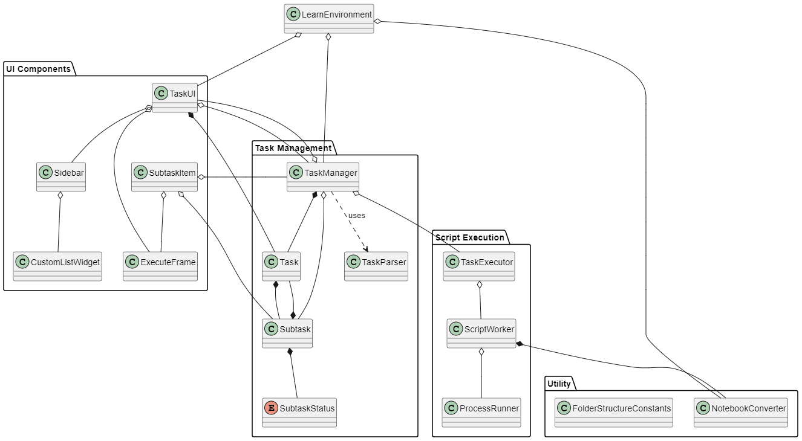

# Codebase Overview

## Introduction
This document provides an overview of the codebase for the `Learn Environment` project for the Franka Panda robot. It includes descriptions of the main components, their interactions, and instructions for setting up and contributing to the project.

## Architecture
The `learn_environment` project is structured into several key components, each responsible for different aspects of the system. The main components are:

- **Task Management**:  
    Handles the creation, execution, and management of tasks.
- **UI Components**:  
    Manages the user interface elements for interacting with tasks.
- **Script Execution**:  
    Converts and executes Jupyter notebooks and other scripts.

### Simplified class diagram:


## Doxygen Documentation
For further insights, view the [Doxygen documentation `index.html`](./doxygen_documentation/html/index.html) for a more in-depth overview.

To generate new Doxygen documentation after making changes, install `Doxygen` and `Graphviz`. Then, navigate to `docs/for_developers/doxygen_documentation` and run:

```bash
doxygen Doxyfile
```

The Doxyfile is preconfigured, but you can adjust it as needed.

## Known Issues
- **Rendering issues with local setups:**  
    RViz has issues rendering content changes. This problem does not occur in noVNC setups but is common in most local setups. Dragging the plugin out of RViz usually resolves the issue.
- **Rendering issues with CPU virtualization:**  
    Black, non-rounded boxes appear behind some rounded borders (e.g. the Help Menu).
- **Logging the `converted.py` file instead of the Jupyter Notebook:**  
    When Jupyter Notebooks are converted to Python files for execution, log messages reference the lines in the converted file. This can make it difficult for users to pinpoint where an error occurred in the original notebook. However, with only 2 or 3 code cells per subtask, this issue is generally manageable. Addressing this would require mapping the lines in the converted file back to the cells in the Jupyter Notebook and adjusting the console output accordingly.
