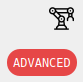

# Creating new difficulty levels

This guide will walk you through the process of creating and integrating new task difficulties in the learn environment.

### Defining Topics

All difficulties are defined in the JSON file located at `/task_pool/difficulty_levels.json`. To add new difficulties, you simply need to modify this file.

### Example Configuration

Here's an example of how the `difficulty_levels.json` file might look:

```json
{
    "difficulty_levels": [
        {
            "name": "beginner",
            "hex-color": "#8fb935"
        },
        {
            "name": "intermediate",
            "hex-color": "#e09c3b"
        },
        {
            "name": "advanced",
            "hex-color": "#e64747"
        }
    ]
}

```

In this example, three difficulties are defined: `beginner`, `intermediate`, and `advanced`. You can add more difficulties to this list as needed.

The hex-colors are used for the color of the difficulty label:



### Using Difficulties in Task Definitions

Once you have defined new difficulties in the `difficulty_levels.json` file, you can use them in your `task_definitions.json` configuration. Simply reference any of the defined difficulties for your tasks.

### Default Difficulty Behavior

If you add difficulties to a task that are not defined in `difficulty_levels.json`, the system will automatically assign a default color and display the difficulty name defined in the `task_definitions.json`.
