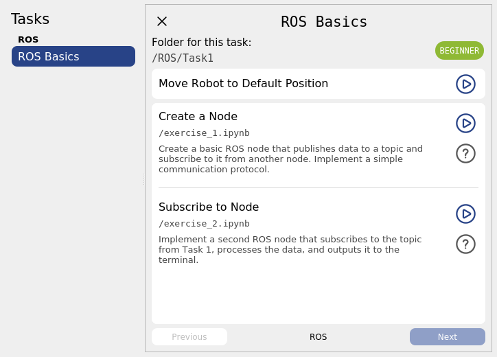

# Create new Tasks for the Learning Environment
You can easily create and integrate new Tasks for the Learning Environment. This documentation will explain step by step how to do that.

Every task has **at least one subtask**, represented by a Jupyter Notebook and the corresponding evaluation script.

## 1. Create a Jupyter Notebook
Start by creating a Jupyter Notebook. It is strongly recommended to use [this template](./../../task_pool/solution_template.ipynb) as a starting point.

### Guidelines
- Use markdown cells to explain the tasks to the user clearly.
- Add code cells as needed to implement the solution.
- Include pre-written code cells for common setups, such as `import` statements, to make the process easier for the user.
- Refer to the existing tasks in the `/task_pool/solution_scripts` folder for inspiration.

### Important
The notebook should include all necessary code, **including the solution**.  
Make sure the solution code is enclosed between two `##### YOUR CODE HERE #####` tags. For example:


### Example:
This code cell in Jupyter:

```python
##### YOUR CODE HERE #####
print("This is the solution code that will be replaced")
##### YOUR CODE HERE #####

print("This is given code that won't be replaced")
```
Will be automatically converted to this:

```python
##### YOUR CODE HERE #####
raise NotImplementedError()

print("This is given code that won't be replaced")
```

<details>
<summary>Click here to see an advanced example and how the solution is displayed</summary>

### Advanced Example:

This code cell in Jupyter:

```python
print("This is given code that won't be replaced")

##### YOUR CODE HERE #####
print("This is the solution code that will be replaced")
##### YOUR CODE HERE #####

print("This is given code that won't be replaced")

if (True):
    ##### YOUR CODE HERE #####
    print("You can also use indentation but also need to indent the 'YOUR CODE HERE' line accordingly")
    # comments will also be replaced
    print("This is the solution code that will be replaced")
    ##### YOUR CODE HERE #####

    print("This is given code that won't be replaced")

```

Will be automatically converted to this:

```python
print("This is given code that won't be replaced")

##### YOUR CODE HERE #####
raise NotImplementedError()

print("This is given code that won't be replaced")

if (True):
    ##### YOUR CODE HERE #####
    raise NotImplementedError()

    print("This is given code that won't be replaced")

```

The user can decide to show the solution. A new code cell will be added directly under the user's cell.

```python
##############################################################
####     THIS IS A SOLUTION CELL. IT WILL NOT EXECUTE.    ####
#### YOU CAN RUN THE SOLUTION DIRECTLY WITHIN THE PLUGIN. ####
####    USE THIS CELL AS INSPIRATION FOR YOUR OWN CODE.   ####
##############################################################

print("This is given code that won't be replaced")

## ↓↓↓↓ SOLUTION CODE HERE ↓↓↓↓ ##
print("This is the solution code that will be replaced")
## ↑↑↑↑ SOLUTION CODE HERE ↑↑↑↑ ##

print("This is given code that won't be replaced")

if (True):
    ## ↓↓↓↓ SOLUTION CODE HERE ↓↓↓↓ ##
    print("You can also use indentation but also need to indent the 'YOUR CODE HERE' line accordingly")
    # comments will also be replaced
    print("This is the solution code that will be replaced")
    ## ↑↑↑↑ SOLUTION CODE HERE ↑↑↑↑ ##

    print("This is given code that won't be replaced")
```
</details>


## 2. Create an evaluation script

The evaluation script is a Python file (`.py`, not a `.ipynb` notebook) that checks whether the user's script is working correctly. There are two modes in which this script can be started:

1. **Default mode**: After executing the user's script.
2. **Parallel mode**: Runs in parallel with the user's script (when the flag `parallelized_evaluation_required` is set to `true`; more on this later).

The first option is easier to implement. However, for certain tasks, continuous monitoring of a robot's state is required (e.g., when evaluating a complete movement with specific waypoints, not just the state at the end).

### Requirements
- At the end of the evaluation, the script must print either `true` or `false` (this should be the final output of the script).
- Before printing `false`, it is recommended to display a helpful error message explaining the failure.
- (Printing `true` is optional. If the script finishes without printing `false`, it will be evaluated as `true`.)

### Minimal Example:
```python
current_position = checkPositionOfRobot()
desired_position = desiredPosition()

evaluation_success = current_position == desired_position
if not evaluation_success:
    print(f"The end position is not correct. Current position: {current_position}, Desired position: {desired_position}")

# required!
print(evaluation_success)
```
For more inspiration, refer to the existing scripts in the `/task_pool/evaluation_scripts` folder.


## 3. Integrate the tasks

Tasks are defined in the JSON file `/task_pool/task_definitions.json`.

As tasks are divided into tasks and subtasks, you need to define some fields in this json file for each task and subtask.

### Steps to add the task
 1. Add your task with all paramters to the JSON file `/task_pool/task_definitions.json` (see below)
 2. Copy all Jupyter notebooks for all subtasks in the `/task_pool/solution_scripts/YOUR_TASK_TOPIC/YOUR_TASK_NAME` folder.
 3. Copy all evaluation scripts for all subtasks in the `/task_pool/evaluation_scripts/YOUR_TASK_TOPIC/YOUR_TASK_NAME` folder.

 How Tasks are sorted in the tutorial is explained in the [Define Topics ReadMe](./define_topics.md).

### JSON Example:
```JSON
{
	"tasks": [
		{
			"title": "ROS Basics",
			"folder": "/ROS/Task1",
			"topic": "ROS",
			"difficulty": "beginner",
			"previous_subtasks_required": true,
			"subtasks": [
				{
					"title": "Create a Node",
					"description": "Create a basic ROS node that publishes data to a topic and subscribe to it from another node. Implement a simple communication protocol.",
					"solution_file": "/exercise_1.ipynb",
					"evaluation_file": "/exercise_1_eval.py",
					"parallelized_evaluation_required": true,
					"reset_robot_before_executing": false
				},
				{
					"title": "Subscribe to Node",
					"description": "Implement a second ROS node that subscribes to the topic from Task 1, processes the data, and outputs it to the terminal.",
					"solution_file": "/exercise_2.ipynb",
					"evaluation_file": "/exercise_2_eval.py",
					"parallelized_evaluation_required": true,
					"timeout_seconds": 120
				}
			]
		},
		// more tasks
		// IMPORTANT: comments are not allowed in JSON
	]
}
```

The configuration will be displayed like this:



### Fields for tasks
| Field          | Description                                          | Optional/Required | Default Value |
|----------------|------------------------------------------------------|-------------------|---------------|
| `title`        | The title of the task                                | Required          | N/A           |
| `folder`        | The relative folder path for all subtask files.<br>Format: `/YOUR_TASK_TOPIC/YOUR_TASK_NAME`, the `/` are important.<br><br> Your solution notebook will then need to be located in `/task_pool/solution_scripts/YOUR_TASK_TOPIC/YOUR_TASK_NAME` <br> Your evaluation script will then need to be located in `/task_pool/evaluation_scripts/YOUR_TASK_TOPIC/YOUR_TASK_NAME`                                  | Required          | N/A           |
| `topic`        | The topic related to the task (all defined Topics are stored in the `/task_pool/task_definitions.json` file. Learn more on how to define topics and what they do [here](./define_topics.md).)                       | Required          | N/A           |
| `difficulty`   | The difficulty level of the task (e.g., beginner, intermediate, advanced)<br>All defined difficulty levels are stored in the `/task_pool/difficulty_levels.json` file. Learn more on how to define difficulty levels and what they do [here](./define_difficulty_levels.md). | Required          | N/A           |
| `subtasks`     | A list of subtasks associated with the task          | Required          | N/A           |
| `previous_subtasks_required` | When set to `true`, all subtasks preceding the started one are automatically executed first. | Optional          | false           |


### Fields for subtasks

| Field                             | Description                                                | Optional/Required | Default Value |
|-----------------------------------|------------------------------------------------------------|-------------------|---------------|
| `title`                           | The title of each subtask                                  | Required          | N/A           |
| `description`                     | A short description of each subtask                        | Required          | N/A           |
| `solution_file`              | The file name of the solution notebook.<br>Format: `/your_notebook_name.ipynb` (`/` required)             | Required          | N/A           |
| `evaluation_file`            | The file name of the evaluation script.<br>Format: `/your_eval_script_name.py` (`/` required)      | Required          | N/A           |
| `parallelized_evaluation_required`| Whether parallelized evaluation is required for the subtask | Optional          | false         |
| `reset_robot_before_executing`    | Whether to reset the robot before executing the subtask    | Optional          | true          |
| `timeout_seconds`                 | The timeout duration for the subtask in seconds. Adjust this if the scripts need to run very long.            | Optional          | 60            |
