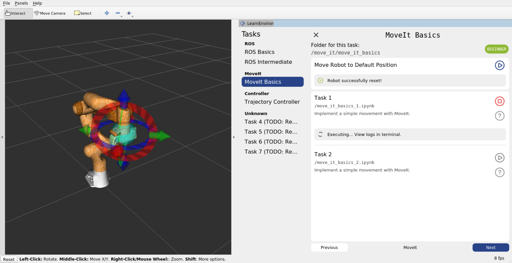

# Welcome to the Tutorial
**Before you start:** We recommend reading the [theoretical introduction](theoretical_introduction.md) first. 

**After that:** Follow these steps to start with the tasks:

1. **Open a Terminal in VS Code**
    Go to `Terminal` > `New Terminal` in the VS Code menu. The shortcut is ``Ctrl + ` ``
    - If you don't use VS Code, open any terminal. If you installed this with a docker setup as recommended , make sure to open the terminal in the container.

2. **Execute the Launch Command**
    
    Type the following command into the terminal and press Enter:
    ```bash
    roslaunch learn_environment tutorial_gazebo.launch
    ```
3. **Open RViz**
    - **Coder / Devcontainer setups:** Open [localhost:6080](http://localhost:6080/) in your browser and click `connect`. In the top bar, you should be able to select RViz, the plugin should show up there immediately.
    - **Local setups without Devcontainer:** When executing the command above, RViz should automatically show up and display the plugin immediately. If you are on Windows or MacOS, make sure to make your display available to Docker with tools like `XLaunch` (Windows) or `XQuartz` (MacOS). 
    - 

4. **Begin with the Tasks**
    - After running the command, the task files for the **tutorial will be copied into this folder**.
    - All tasks are Jupyter Notebooks. Some code is already provided in the notebook; **your task** is to **replace** the `throw notImplementedError()` with your **own code**.
    - Which file you need to open is specified in the plugin.
    - **IMPORTANT**: Do not execute these notebooks directly from VS Code. This may result in unwanted behavior and won't trigger the evaluation. Use the `start` button in the plugin.
    - If you need help with a task, click on the `question mark` next to your current task, where you can show the solution. This will automatically add new code cells with the solution to your notebook.

Familiarize yourself with RViz and start working on the tasks at your own pace!

## FAQ:

<details>
<summary>Nothing happens when I click something in the plugin.</summary>

- For local setups, there often are **graphic bugs** with RViz. You can drag the plugin out of RViz and everything should render fine. (Do not just dock it elsewhere but move the plugin to a new window.)

</details>

<details>
<summary>I accidentally closed the plugin. How to open it again?</summary>

- In RViz, click on `Panels`>`Add` and choose `Learn Environment` after that.

</details>

<details>
<summary>I closed RViz or Gazebo. How to open it again?</summary>

- Go to the terminal. If the last process is still running, kill it with `CTRL` + `C`. After that, enter `roslaunch learn_environment tutorial_gazebo.launch` again.

</details>

<details>
<summary>How can I see solutions for the task?</summary>

- Click on the **question mark** next to the task you are working on. Then click **`Show Solutions`**. 
- After that, right below your own code cells in the Jupyter Notebook, solution cells are added. If you want to play the solutions, just click on play. 
- If the solutions are not hidden, you can choose if you want to execute your own code or the solution.

</details>

<details>
<summary>Where are the solutions?</summary>

- After clicking on `Show Solutions` the solutions are automatically added below your own code cells in the Jupyter Notebook.
- On **slow devices**, VS Code might not refresh the Notebook instantly, you may have to close the notebook and open it up again.

</details>

<details>
<summary>I messed up or deleted a notebook. How can I get back the notebook for the task?</summary>

- Click on the **question mark** next to the task you want to restore. Then click **`Reset Notebook`**.
- **Caution:** this will create a completely new notebook, all your changes will be lost.

</details>

<details>
<summary>Why does the robot sometimes reset before executing my script?</summary>

- This will be **different for every task**. Some tasks require the robot to be in its default position for evaluating if your script is correct.
- If required, the robot will reset **automatically** before executing your script, you don't need to worry about manually resetting the robot.

</details>

<details>
<summary>Why are my other tasks sometimes executed before the started task?</summary>

- This will be **different for every task**. Some tasks depend on the subtask before to be executed.
- The previous scripts will be started **automatically**, you don't need to worry about manually starting them.

</details>

<details>
<summary>I get a NotImplementedError.</summary>

- This will occur if you haven't edited a code cell yet, where you have to change code.
- After the `#### YOUR CODE HERE ####` tag, remove the `raise NotImplementedError()` line and replace it with your own code.

</details>